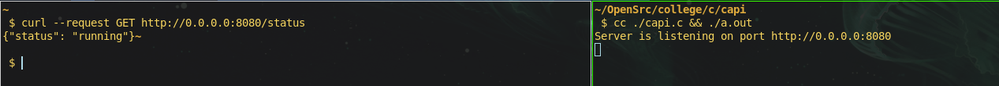
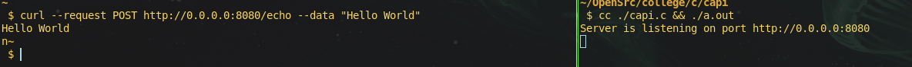
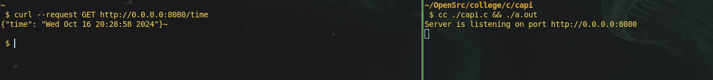
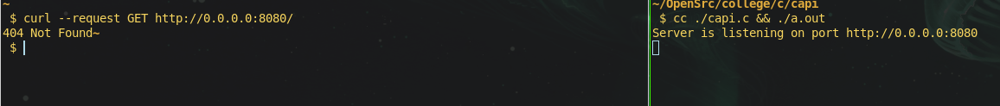

## Introduction to Question

This document describes a simple HTTP server implementation in C that can handle
basic REST API requests, including checking the server status, echoing input strings,
and providing the current server time.

## Solution Proposal

The proposed solution involves creating a multithreaded HTTP server that listens
on a specified port and responds to three main endpoints: `GET /status`,
`POST /echo`, and `GET /time`. The server uses TCP sockets for reliable communication
and provides appropriate JSON or plain text responses based on the requests it receives.

## Explanation of the code

The code implements a basic HTTP server with the following key components:

1. **Socket Creation**:
   The server begins by creating a TCP socket using the `socket()` function, allowing it to listen for incoming connections.
   ```c
   server_fd = socket(AF_INET, SOCK_STREAM, 0);
   ```

2. **Binding the Socket**:
   The server binds the socket to a specified port, allowing it to listen for requests on that port.
   ```c
   server_addr.sin_family = AF_INET;
   server_addr.sin_addr.s_addr = INADDR_ANY;
   server_addr.sin_port = htons(PORT);
   bind(server_fd, (struct sockaddr *)&server_addr, sizeof(server_addr));
   ```

3. **Listening for Connections**:
   The server starts listening for incoming connections with a specified backlog.
   ```c
   listen(server_fd, MAX_CONCURRENT_REQUESTS);
   ```

4. **Handling Requests**:
   When a client connects, the server accepts the connection and reads the incoming request. It determines the requested endpoint by checking the request string.
   ```c
   // wait for client requests
    client_fd = accept(server_fd, (struct sockaddr *)&client_addr, &client_addr_len);

    if (client_fd < 0) {
        perror("Accept failed");
        continue;
    }

    handle_request(client_fd);
   ```

5. **Generating Responses**:
   Depending on the request, the server generates different types of responses:
   - For `GET /status`, it responds with a JSON indicating that the server is running:
     ```c
     send_json_response(client_fd, 200, "{\"status\": \"running\"}");
     ```
   - For `POST /echo`, it echoes back the input string:
     ```c
     char *body = find_index_in_of(buffer, "\r\n\r\n");
     send_text_response(client_fd, 200, body);
     ```
   - For `GET /time`, it fetches the current time and sends it as a JSON response:
     ```c
     time_t now = time(0);
     char *time_str = ctime(&now);
     snprintf(jsonText, sizeof(jsonText), "{\"time\": \"%s\"}", time_str);
     send_json_response(client_fd, 200, jsonText);
     ```

6. **Error Handling**:
   If the requested endpoint is not recognized, a 404 Not Found response is generated:
   ```c
   send_text_response(client_fd, 404, "404 Not Found");
   ```

7. **Closing Connections**:
   Finally, the server closes the client connection after responding.
   ```c
   close(client_fd);
   ```

The server runs in an infinite loop, continuously accepting and handling client connections, ensuring it can serve multiple requests.


## Output of the code

Below are sample outputs from the server for various requests:

1. **GET /status** request:
   

2. **POST /echo** request with the body "Hello World":
   

3. **GET /time** request:
   

4. **404 Not Found** request:
   
