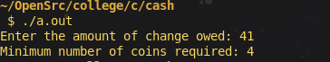
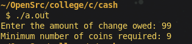
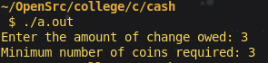

## Introduction to Question

The task is to create a program that calculates the minimum number of coins required to make a certain amount of change using a given set of coin denominations (25¢, 10¢, 5¢, and 1¢). The program should prompt the user to input an amount and return the smallest number of coins that can make up that amount. The problem can be solved using a **greedy algorithm**, which ensures that the largest coins are used first to minimize the number of coins.

## Solution Proposal

To solve the problem, the **greedy algorithm** approach is used. This involves starting with the largest coin denomination and reducing the remaining amount of change until the smallest denomination is reached. By always subtracting the highest value first, we ensure that the number of coins used is minimized.

### Steps:
1. Prompt the user for the amount of change owed (in cents).
2. Use the greedy approach to determine how many of each coin denomination (25¢, 10¢, 5¢, 1¢) is needed.
3. Calculate and return the total number of coins required.

## Explanation of the Code

### 1. **Coin Calculation Function:**

```c
int calculate_coins(int change) {
    int coins = 0;
    int denominations[] = {25, 10, 5, 1};
    int num_denominations = 4;
    for (int i = 0; i < num_denominations; i++) {
        coins += change / denominations[i];
        change %= denominations[i];
    }
    return coins;
}
```
- **Function:** `calculate_coins()` takes the amount of change in cents and calculates the minimum number of coins needed.
- **Denominations Array:** The array `denominations[]` holds the coin values in descending order (25¢, 10¢, 5¢, and 1¢).
- **Greedy Algorithm:** In the loop, the program divides the total change by the current denomination to find how many coins of that type are needed. It then updates the `change` by taking the remainder (`%`). This process is repeated for all coin types, from largest to smallest.
- **Return Value:** The function returns the total number of coins used.

### 2. **Main Function and Input Handling:**

```c
int main() {
    int change;
    do {
        printf("Enter the amount of change owed: ");
        scanf("%d", &change);
    } while (change < 0);
    int coins = calculate_coins(change);
    printf("Minimum number of coins required: %d\n", coins);
    return 0;
}
```
- **User Input:** The program prompts the user to enter a non-negative integer value (the amount of change in cents). The `do-while` loop ensures that the user cannot enter a negative number.
- **Coin Calculation:** The user’s input is passed to the `calculate_coins()` function to determine the number of coins.
- **Output:** The result (minimum number of coins) is printed.

## Output of the Code

Here are some examples of input and output:

#### Example 1: 
**Input:**
```
Enter the amount of change owed: 41
```
**Output:**
```
Minimum number of coins required: 4
```


**Explanation:** 41¢ can be given as 1 × 25¢ + 1 × 10¢ + 1 × 5¢ + 1 × 1¢, for a total of 4 coins.

#### Example 2: 
**Input:**
```
Enter the amount of change owed: 99
```
**Output:**
```
Minimum number of coins required: 9
```


**Explanation:** 99¢ can be given as 3 × 25¢ + 2 × 10¢ + 4 × 1¢, for a total of 9 coins.

#### Example 3: 
**Input:**
```
Enter the amount of change owed: 3
```
**Output:**
```
Minimum number of coins required: 3
```


**Explanation:** 3¢ can be given as 3 × 1¢, for a total of 3 coins.