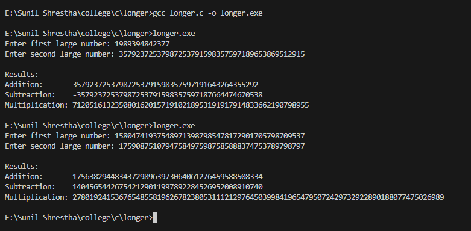
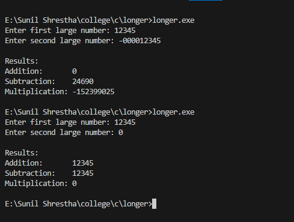
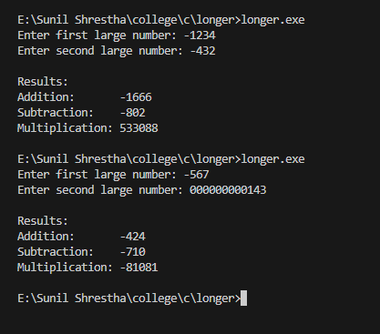

<!-- documentation here, based on the format provided in the README.md file -->

## Introduction to Question

The task is to implement arithmetic operations like **addition**, **subtraction**, and **multiplication** of large numbers that cannot be stored in standard data types like `int` or `long`.  
The program must:
- Handle **positive and negative** numbers.
- Perform operations **digit by digit**, simulating manual arithmetic.
- Avoid overflow issues by using **arrays or strings** to represent numbers.

---

## Solution Proposal

We can represent large numbers using **strings** (arrays of characters).  
Each digit is processed one by one, from least significant to most significant, just like in manual calculations.

---

### Function for Doing Arithmetic Calculations

1. **Addition:** While doing the addition of signed numbers, there are 2 cases:

   **Case 1: Numbers are of Same sign**
   - Both numbers are either positive or negative.
   - Magnitude: Sum of absolute values `(|A| + |B|)`.
   - Resulting sign: Same as the numbers have.

   **Case 2: Numbers are of Different signs**
   - One number is positive and the other is negative.
   - Magnitude: Difference of absolute values `(|A| - |B|)`.
   - Resulting sign: Sign of the number having the higher magnitude.

2. **Subtraction:** Flipping the sign of the second number, we can reuse the addition method for doing subtraction.

   **Step 1: Flip the sign of the second number**
   - If B is positive then treat it as -B.
   - If B is negative then treat it as +B.

   Then perform signed addition.

   **Step 2: Apply addition rules**
   - Same signs: sum of magnitudes, sign same.
   - Different signs: difference of magnitudes, sign of larger magnitude.

3. **Multiplication:** While doing multiplication, operands are always multiplied, and the sign depends only on the signs of the operands.

   **Step 1: Multiply magnitudes**
   - Ignore signs and multiply `|A| × |B|`.

   **Step 2: Determine the sign**
   - If the numbers have the same sign, the result is positive (+).
   - If the numbers have different signs, the result is negative (-).
   > Fun fact : The resulting sign is `XOR (^)` of sign of 2 numbers.

---
--- 

## Explanation of the code
### A. **Utility Functions:**
These are helper function which modularize the code and enhance readability and maintainability.

### **1. Removing Leading Zeros**
Removes leading zeros from the user input by moving the substring starting at the first non-zero character to the beginning of the array.  
This works by counting the number of `0`s excluding the last digit, and then using the `memmove()` function to shift the remaining digits to the start of the array.

- The last digit is excluded from zero counting in case the input itself is `0`.  
- The `void* memmove(void* dest, void* src, size_t n)` function moves `n` bytes of data from `src` pointer address to `dest` pointer address, even if the source and destination memory regions overlap.

---

### **2. Reversing the Number**

Since calculations are performed from **Least Significant Digit (LSD)** to **Most Significant digit (MSD)**, reversing the number provides a straightforward way to digit by digits calculation. The function reverses the given numeric string in place by swapping characters from both ends toward the center.

---

### **3. Apply Sign**
Adds a negative sign (`-`) to the result string when required, ensuring correct sign representation after magnitude calculation.  
Following the **DRY (Do Not Repeat Yourself)** principle, this function modularizes the recurring task of sign handling.

---
---

### B. Wrapper Functions
 
### 1. Addition Wrapper
1. **Check signs and set flags**
   - If `A` starts with `'-'`, raise a **negative flag** for `A`.
   - If `B` starts with `'-'`, raise a **negative flag** for `B`.

2. **Extract magnitudes**
   - Remove the sign (if any) to obtain the **absolute values** `|A|` and `|B|`.

3. **If both numbers have the same sign**
   - Compute the sum:  
     `Result = |A| + |B|`
   - The resulting sign will be **the same** as the inputs’ sign.

4. **If signs differ**
   - Compare magnitudes `|A|` and `|B|`.
     - **If** `|A| == |B|`, then  
       `Result = 0` (since `A + (-A) = 0`)
     - **Else**, subtract the smaller magnitude from the larger:  
       `Result = |larger| - |smaller|`
     - The resulting sign will be the sign of the **larger magnitude** number.

5. **Return the final signed result**


### 2. Subtraction Wrapper
Subtraction can be rewritten as:  `A - B = A + (-B)`
1. **Flip the sign of second number**
    - If `B` starts with `'+'`, make it `'-B'`.
    - If `B` starts with `'-'`, make it `'+B'`.
2. **Reuse the addition algorithm**
   - Call the **addition function** using `A` and the **sign-flipped** `B`.

3. **Return the result**

### 3. Multiplication
1. **Initialize a sign flag**

2. **Check and record the signs of operands**
   - If `A` starts with `'-'`, remove the sign (`A = A + 1`) and toggle `negative`.
   - If `B` starts with `'-'`, remove the sign (`B = B + 1`) and toggle `negative`.
   - This ensures the result is **negative only if one** of them is negative.

3. **Multiply the magnitudes**

4. **Apply the sign**
   - If `negative` is `true`, prepend `'-'` to the result. 
5. **Return the final result**
   - The returned string represents the signed product of `A` and `B`.


## C. Arithmetic logic function

### 1. Addition Logic

The addition is performed digit by digit, handling a potential **carry**. The loop continues as long as there are digits in either number (`lenA`, `lenB`) or a `carry` remains.


```c
for (; i < lenA || i < lenB || carry; i++) {
    int digitA = i < lenA ? revA[i] - '0' : 0;
    int digitB = i < lenB ? revB[i] - '0' : 0;

    int sum = digitA + digitB + carry;

    res[i] = (sum % 10) + '0';

    carry = sum / 10;
}
res[i] = '\0';
```


* `int digitA = i < lenA ? revA[i] - '0' : 0;`: Converts the character digit to its **numeric value** (`'0'` is subtracted). If the index `i` exceeds the length of `revA`, **zero padding** is used.
* `int sum = digitA + digitB + carry;`: Calculates the total sum for the current position.
* `res[i] = (sum % 10) + '0';`: Stores the **ones digit** (`sum % 10`) of the result at index $i$, converted back to a character.
* `carry = sum / 10;`: Updates the **carry** (the tens digit) for the next iteration.
* `res[i] = '\0';`: Ensures the result string is properly **null-terminated** after the loop finishes.

---

## 2. Subtraction Logic

The subtraction assumes the first number (**A**) is **greater than or equal to** the second number (**B**), simplifying the padding logic for the second number. It handles a potential **borrow**. The loop runs only as long as there are digits in the larger number (`lenA`).

```c
for (; i < lenA; i++) {
    int digitA = revA[i] - '0';
    int digitB = i < lenB ? revB[i] - '0' : 0;

    int diff = digitA - digitB - borrow;

    if (diff < 0) {
        diff += 10; 
        borrow = 1; 
    } else {
        borrow = 0; 
    }

    res[i] = diff + '0';
}
```

* `int digitB = i < lenB ? revB[i] - '0' : 0;`: Similar to addition, this handles **zero padding** for the shorter number $B$. Since $A \\ge B$ is assumed, the loop only needs to run up to `lenA`.
* `int diff = digitA - digitB - borrow;`: Calculates the difference for the current position, including the **previous borrow**.
* The `if (diff < 0)` block handles the **borrowing** mechanism:
    * `diff += 10;`: Adds 10 to the difference (as if 1 was borrowed from the next digit of $A$).
    * `borrow = 1;`: Sets the borrow flag to be applied to the next position.
* `res[i] = diff + '0';`: Stores the final difference for index $i$, converted back to a character.
`;

## 3. Multlipication
The multiplication logic follows the same manual approach used in paper-based long multiplication.  
Each digit of `A` is multiplied with each digit of `B` starting from the least significant side.  
Intermediate results are accumulated in a temporary array `temp[]`.\
**Formula:** 
- mul = A[i] × B[j]
- sum = mul + temp[posLow]
- `posLow` = Right pointer (current digit position)  
- `posHigh` = Left pointer (carry position) 


**Dry Run for `123 × 45 = 5535`**

| i | j | A[i] | B[j] | mul | temp (before) | posLow | posHigh | sum | temp (after) | Remarks | 
|:---:|:---:|:-------:|:-------:|:-----:|:---------------|:---------:|:----------:|:-----:|:---------------:|:-----------:|
| 2 | 1 | 3 | 5 | 15 | {0,0,0,0,0} | 4 | 3 | 15 | {0,0,0,1,5} |3x5|
| 2 | 0 | 3 | 4 | 12 | {0,0,0,1,5} | 3 | 2 | 13 | {0,0,1,3,5} |15 + 3x40|
| 1 | 1 | 2 | 5 | 10 | {0,0,1,3,5} | 3 | 2 | 13 | {0,0,2,3,5} |135 + 20x5|
| 1 | 0 | 2 | 4 | 8  | {0,0,2,3,5} | 2 | 1 | 10 | {0,1,0,3,5} |235 + 20x40|
| 0 | 1 | 1 | 5 | 5  | {0,1,0,3,5} | 2 | 1 | 5  | {0,1,5,3,5} |1035 + 100x5|
| 0 | 0 | 1 | 4 | 4  | {0,1,5,3,5} | 1 | 0 | 5  | {0,5,5,3,5} |1535 + 100x40|


### D. Main Function
The code execution starts from `main()` function which handles following task:
- **User input:** The program prompt user to add 2 large numbers and store them by removing leading 0s.
- **Calculation:** Pass the input to wrapper function which returns the output after calculation.
- **Output:** At last obtained result are displayed in the terminal.

---
---
## Output of the Code

### Running the code with large numeric values


### Trying different test cases


