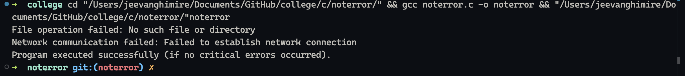

# Introduction to Question

In this program, we are tasked with implementing a robust error-handling mechanism in C. The program must handle three primary operations: file operations, memory allocation, and network communication. Additionally, it should log any errors that occur, return appropriate error codes, and exit the program gracefully in case of critical errors (e.g., memory allocation failure). The error handler will log all the relevant error details into a log file (`error_log.txt`) and manage error messages efficiently.

## Solution Proposal

To meet the requirements of this task:

1. We define **centralized error codes** for different error types such as file I/O, memory allocation, and network errors.
2. We implement a function `void handle_error(int error_code, const char* message)` that handles errors based on the error code, logs errors to a file, and prints user-friendly messages to the console.
3. We create macros to simplify passing error details such as function name and line number to the error handler.
4. We ensure that critical errors (e.g., memory allocation failure) cause the program to terminate gracefully after releasing any allocated resources.

## Explanation of the Code

1. **Defining Error Codes and Logging Function**:
    - We define error codes for file operations (`FILE_ERROR`), memory allocation (`MEMORY_ERROR`), and network operations (`NETWORK_ERROR`).
    - The `log_error()` function is responsible for logging error details into the log file, capturing error type, error message, the function where the error occurred, and the line number. A timestamp is added for traceability.

2. **Error Handler Function**:
    - The `handle_error()` function manages different types of errors by taking in an error code and printing the corresponding error message to the console. It also calls `log_error()` to log the error to a file.
    - For critical errors (e.g., `MEMORY_ERROR`), the function exits the program after logging the error.

3. **Simplified Error Handling Using Macros**:
    - We use a macro `HANDLE_ERROR(code, message)` to simplify error handling. This macro captures the function name (`__FUNCTION__`) and line number (`__LINE__`) automatically.

4. **Example Operations**:
    - We implement file operations, memory allocation, and network communication (as a placeholder) within dedicated functions (`perform_file_operation()`, `perform_memory_allocation()`, `perform_network_operation()`) to demonstrate how errors are handled in various scenarios.

## Output of the Code

### Sample Console Output





### Sample Log File (`error_log.txt`)

```
[Mon Oct  7 09:45:32 2024] ERROR: FILE ERROR | Message: No such file or directory | Function: perform_file_operation | Line: 23
[Mon Oct  7 09:45:32 2024] ERROR: MEMORY ERROR | Message: Failed to allocate memory | Function: perform_memory_allocation | Line: 31
[Mon Oct  7 09:45:32 2024] ERROR: NETWORK ERROR | Message: Failed to establish network connection | Function: perform_network_operation | Line: 41
```

In summary, this program provides a robust error-handling mechanism for different types of operations. It ensures that errors are logged appropriately and that critical errors result in a graceful exit, safeguarding the program from undefined behavior.
