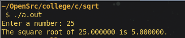
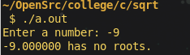
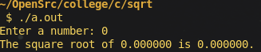

## Introduction to Question

The task is to calculate the square root of a given number without using the built-in `sqrt()` function. The program should handle special cases such as negative numbers and `0`. Additionally, it should continue refining the square root approximation until the result is accurate up to 6 decimal places. The Newton-Raphson method is suggested for solving the problem.

## Solution Proposal

The **Newton-Raphson method** is an iterative approach used to approximate the square root of a number. We start with an initial guess and refine it by using the formula:

$$x_{n+1} = \frac{1}{2} \left(x_n + \frac{S}{x_n}\right)$$

Where:
- $$\(S\)$$ is the number whose square root is being approximated.
- $$\(x_n\)$$ is the current guess.

This method converges quickly to the accurate square root value. To achieve accuracy up to 6 decimal places, the iteration is continued until the difference between successive guesses is less than `0.000001`.

### Special Case Handling:
1. **Negative numbers**: The square root of a negative number is undefined in the real number system. The program should handle this by printing an error message and returning a negative result to indicate failure.
2. **Zero**: The square root of zero is zero. The program should return `0` directly without performing any iterations.

## Explanation of the Code

### 1. **Function Definition:**

```c
double c_sqrt(double num)
```
This function calculates the square root using the Newton-Raphson method. It accepts a single parameter:
- `num`: The number whose square root needs to be computed.

### 2. **Initial Conditions and Special Cases:**

```c
if (num < 0) {
    return -1;
}
if (num == 0) {
    return 0;
}
```
The program first checks if the input is negative or zero. For negative inputs the function returns `-1`. If the input is `0`, it returns `0` directly.

### 3. **Newton-Raphson Iteration:**

```c
 // assume the number as intial guess
double guess = num;
// error upto 6th decimal places ( 10 * -6 )
double epsilon = 1e-6;
// initial difference zero
double difference = 0;
do {
    double next_guess = 0.5 * (guess + num / guess);
    difference = absf(next_guess - guess);
    guess = next_guess;
} while (difference > epsilon);
```
- **Initial guess**: The initial guess is set to the input number itself.
- **Epsilon**: A small value (`0.000001`) is used as the threshold for the difference between two successive guesses.
- **Iteration**: The iteration continues until the change between the current guess and the next guess is smaller than `epsilon`, ensuring 6-decimal-place accuracy.

### 4. **Main Function and User Input:**

```c

int main() {
    double num;
    printf("Enter a number: ");
    scanf("%lf", &num);
    double result = c_sqrt(num);
    if(result>=0){
        printf("The square root of %lf is %lf.\n",num,result);
    }else{
        printf("%lf has no roots.\n",num);
    }
}
   
```
- The user is prompted to enter a number.
- The `c_sqrt()` function is called to compute the square root.
- The result is printed with an accuracy of 6 decimal places. If the input was negative, no result is printed, and an error is shown.

## Output of the Code

The following shows example outputs based on different inputs:

### Example 1: Positive Number
**Input:**
```
Enter a number: 25
```
**Output:**
```
The square root of 25.000000 is 5.000000.
```


### Example 2: Negative Number
**Input:**
```
Enter a number: -9
```
**Output:**
```
-9.000000 has no roots.
```



### Example 3: Zero
**Input:**
```
Enter a number: 0
```
**Output:**
```
The square root of 0.000000 is 0.000000.
```


---