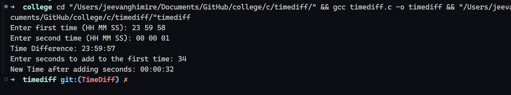

# Introduction to Question

This program addresses the requirement to read two time inputs in 24-hour format (hours, minutes, and seconds), calculate the time difference between them, and add a specified number of seconds to one of the time inputs. The program also ensures that the time calculations handle edge cases such as crossing midnight and scenarios where the first time is greater than the second time.

## Solution Proposal

The solution involves creating a structure to handle time values and defining functions for calculating the difference between two times and for adding seconds to a given time. The program takes user input for the two times and the number of seconds to add, performs the calculations, and outputs the results in a readable format.

## Explanation of the Code

### Structure Definition

In both C and C++, we define a structure named `Time` to encapsulate hours, minutes, and seconds as follows:

```c
typedef struct {
    int hours;
    int minutes;
    int seconds;
} Time;
```plaintext

### Functions

1. **time_difference**: This function computes the difference between two `Time` structures.

   - It converts both time inputs into total seconds.
   - It calculates the difference and checks for wrapping if the second time is greater.
   - It then converts the resulting seconds back into hours, minutes, and seconds.

   ```c
   Time time_difference(Time t1, Time t2);
   ```

1. **add_seconds**: This function adds a specified number of seconds to a given `Time` structure.

   - It calculates total seconds for the original time plus the seconds to add.
   - It wraps around using the modulus operator to ensure the result is within a 24-hour format.

   ```c
   Time add_seconds(Time t, int seconds_to_add);
   ```

### Main Function

The `main` function performs the following tasks:

- Inputs two time values from the user.
- Calls `time_difference` to compute and display the difference.
- Inputs additional seconds and calls `add_seconds` to compute and display the new time.

Here's a snippet from the `main` function in C:

```c
int main() {
    Time time1, time2;
    int seconds_to_add;

    // Input first time
    printf("Enter first time (HH MM SS): ");
    scanf("%d %d %d", &time1.hours, &time1.minutes, &time1.seconds);
    
    // Input second time
    printf("Enter second time (HH MM SS): ");
    scanf("%d %d %d", &time2.hours, &time2.minutes, &time2.seconds);

    // Calculate and display the difference
    Time diff = time_difference(time1, time2);
    printf("Time Difference: %02d:%02d:%02d\n", diff.hours, diff.minutes, diff.seconds);

    // Input seconds to add
    printf("Enter seconds to add to the first time: ");
    scanf("%d", &seconds_to_add);
    
    // Calculate and display the new time
    Time new_time = add_seconds(time1, seconds_to_add);
    printf("New Time after adding seconds: %02d:%02d:%02d\n", new_time.hours, new_time.minutes, new_time.seconds);

    return 0;
}
```

### Edge Cases Handled

- The program checks for negative time differences, ensuring it wraps the time difference correctly around 24 hours.
- It properly processes times that cross midnight when adding seconds.

## Output of the Code

When the program is executed, it will prompt the user for two times and the number of seconds to add. Here is an example of the expected output:


### Explanation of the Example Output

1. The user entered `23:59:58` for the first time and `00:00:01` for the second time.
2. The time difference is calculated as `23:59:57`, demonstrating the wrap around midnight.
3. When adding 5 seconds to `23:59:58`, the output correctly gives `00:00:03`, confirming the functionality works as intended.

This structured approach ensures that the program meets the requirements while providing clarity and documentation for future reference or enhancements.
