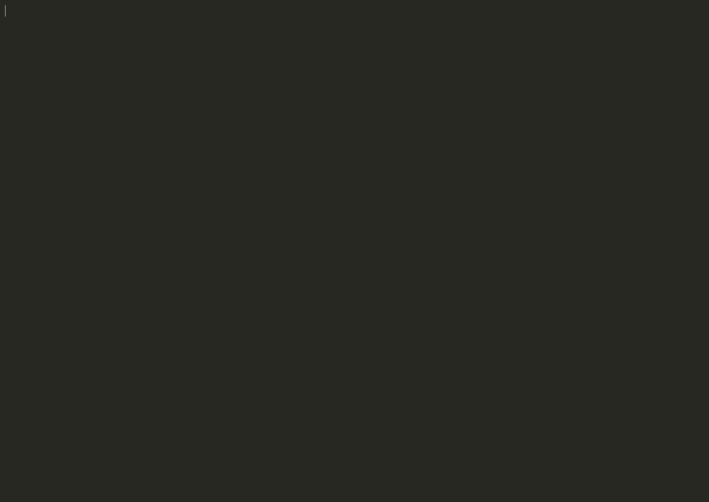

## Introduction to Question
This program implements a runoff voting system. In this system, multiple candidates compete in an election, and voters rank their preferences. The program tabulates votes, eliminates candidates with the least votes, and continues the process until a winner is determined or a tie occurs.

## Solution Proposal
The program is designed to manage candidate voting through multiple rounds, accounting for voter preferences. It uses a structure to maintain candidate information and an array to track votes. Key functions include vote capturing, tabulating votes, checking for a winner, eliminating candidates, and handling ties.

## Explanation of the Code

### Key Components

1. **Data Structures**:
   - **Candidate Structure**: This structure holds the candidate's name, the number of votes they have received, and their elimination status.

   ```c
   typedef struct {
       string name;
       int votes;
       bool eliminated;
   } candidate;
   ```

   Here, `string` is defined as `char*`, making it easier to handle names. Each candidate starts with zero votes and is not eliminated initially.

2. **Functions**:
   - **Vote Function**: This function captures a voter's preference and updates the preference table.

   ```c
   bool vote(candidates_t *candidates, int pref_table[MAX_VOTERS][MAX_CANDIDATES], int voter, int rank, string name) {
       for (int i = 0; i < candidates->count; i++) {
           if (strcmp(candidates->candidates[i].name, name) == 0) {
               pref_table[voter][rank] = i;
               return true;
           }
       }
       return false;
   }
   ```

   In this snippet, we loop through the candidates and compare the provided name with each candidate's name. If a match is found, the voter's preference is stored in the preference table.

   - **Tabulate Function**: This function counts the votes for non-eliminated candidates.

   ```c
   void tabulate(candidates_t *candidates, int pref_table[MAX_VOTERS][MAX_CANDIDATES], int voter_count) {
       for (int i = 0; i < voter_count; i++) {
           for (int j = 0; j < candidates->count; j++) {
               int candidate_index = pref_table[i][j];
               if (!candidates->candidates[candidate_index].eliminated) {
                   candidates->candidates[candidate_index].votes++;
                   break; 
               }
           }
       }
   }
   ```

   Here, for each voter, we check their preferences in order. We increment the vote count of the first non-eliminated candidate they prefer.

   - **Print Winner Function**: This function checks if any candidate has received a majority of votes.

   ```c
   bool print_winner(candidates_t *candidates, int voter_count) {
       int majority = voter_count / 2;
       for (int i = 0; i < candidates->count; i++) {
           if (candidates->candidates[i].votes > majority) {
               printf("%s\n", candidates->candidates[i].name);
               return true;
           }
       }
       return false;
   }
   ```

   The majority is calculated, and we check each candidate's vote count against this majority. If a candidate exceeds it, their name is printed as the winner.

3. **Main Flow**:
   - The program begins by checking for valid command-line arguments, initializes candidates based on provided names, and prompts the user for the number of voters.

   ```c
   if (argc < 2 || argc > MAX_CANDIDATES + 1) {
       printf("Usage: runoff [candidate ...]\n");
       return 1;
   }
   ```

   If the arguments are invalid, an error message is displayed.

   - Voting occurs, and rounds of counting and elimination are conducted until a winner is found or a tie is declared.

   ```c
   while (true) {
       tabulate(&candidates, pref_table, voter_count);
       if (print_winner(&candidates, voter_count)) {
           break;
       }
       int min = find_min(&candidates);
       if (is_tie(&candidates, min)) {
           // Print tied candidates
           break;
       }
       eliminate(&candidates, min);
       // Reset votes for the next round
   }
   ```

   This loop continues to tabulate votes, check for a winner, and eliminate candidates until a winner is determined or a tie occurs.


## Output of the Code

