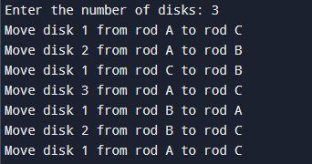

<!-- documentation here, based on the format provided in the README.md file -->

## Introduction to Question

The Tower of Hanoi is a classic problem in computer science and mathematics, known for its elegant recursive solution.

The Tower of Hanoi puzzle consists of three rods and a number of disks of different sizes which can slide onto any rod. The puzzle starts with the disks neatly stacked in ascending order of size on one rod, the smallest disk at the top, thus making a conical shape.

The objective of the puzzle is to move the entire stack to another rod, obeying the following rules:

1. Only one disk can be moved at a time.
2. Each move consists of taking the upper disk from one of the stacks and placing it on top of another stack or on an empty rod.
3. No larger disk may be placed on top of a smaller disk.

## Solution Proposal

Follow the steps below to solve the problem:

* Create a function towerOfHanoi where pass the N (current number of disk), source, dest, helper.
* Make a function call for N – 1 th disk.
* Then print the current the disk along with source and dest
* Again make a function call for N – 1 th disk.

## Explanation of the code

This Python function implements a recursive solution to the Tower of Hanoi problem. Let's break it down step by step: 
1. The function TowerOfHanoi takes four parameters:
    * n: The number of disks
    * source: The source rod (where the disks start)
    * dest: The destination rod (where the disks should end up)
    * helper: The helper rod (used as a temporary holding place)
    
    ```python
    def TowerOfHanoi(n, source, dest, helper):
    ```
2. This is the base case for the recursion. If there are no disks to move (n == 0), the function simply returns, doing nothing.
    ```python
    if n == 0:
            return
    ```
3. This is the first recursive call. It moves n-1 disks from the source to the helper, using the dest as a temporary holding place.
    ```python
    TowerOfHanoi(n-1, source, helper, dest)
    ```
4. After moving the n-1 smaller disks out of the way, this line prints the action of moving the largest disk (disk n) from the source to the dest.
    ```python
    print("Move disk", n, "from rod", source, "to rod", helper)
    ```
5. This is the second recursive call. It moves the n-1 disks that were previously moved to the helper onto the dest, using the source as a temporary holding place.
    ```python
    TowerOfHanoi(n-1, helper, dest, source)
    ```
## Output of the code


