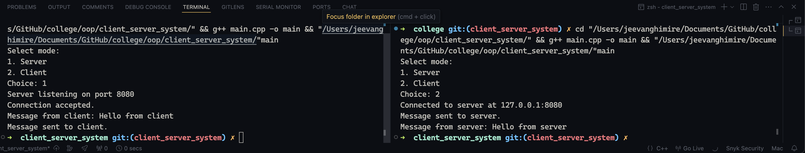

<!-- documentation here, based on the format provided in the README.md file -->

# Combined Server-Client Program in C++

## Introduction to Example

This C++ program demonstrates a basic client-server communication using object-oriented programming (OOP) principles. The program allows users to choose whether to run the **server** or **client** from a single executable. The server listens for incoming connections on a specified port and accepts connections from clients. The client connects to the server and exchanges messages.

Both the server and client functionalities are encapsulated in respective classes, `Server` and `Client`. The program flow allows users to select the role (server or client) at runtime. The client sends a message to the server, and the server responds, demonstrating basic communication between the two entities.

## Explanation of the code (How is OOP Implemented)

### 1. **Class Definitions**:
- **`Server` Class**: 
    - Handles server-side operations, such as creating a listening socket, accepting client connections, and sending/receiving data.
    - **Attributes**:
        - `server_fd`: Socket file descriptor for the server.
        - `server_addr`: Structure to store server address information.
    - **Methods**:
        - `accept_connection()`: Waits for a client to connect and returns a new socket for communication.
        - `close_server()`: Closes the server socket after communication.

- **`Client` Class**: 
    - Responsible for client-side operations, including connecting to the server and sending/receiving data.
    - **Attributes**:
        - `client_fd`: Socket file descriptor for the client.
        - `server_addr`: Structure to store server address information.
    - **Methods**:
        - `close_client()`: Closes the client socket after communication.

### 2. **Main Program Flow**:
- The user is prompted to choose whether to run the server or client. Based on the choice, the respective function (`run_server()` or `run_client()`) is called.
  
#### **Server Operation**:
1. The server listens on port `8080` for incoming connections.
2. Once a client connects, the server receives a message from the client and displays it.
3. The server sends a response message back to the client and then closes the connection.

#### **Client Operation**:
1. The client connects to the server at `127.0.0.1` (localhost) on port `8080`.
2. The client sends a message to the server and then waits for a response.
3. Upon receiving the server’s message, the client displays it and closes the connection.

### 3. **OOP Implementation**:
- The program uses object-oriented principles to separate the server and client logic into their respective classes (`Server` and `Client`). 
- Encapsulation is achieved by keeping socket creation, binding, and connection logic within the appropriate classes, exposing only the necessary methods (`accept_connection()`, `close_server()`, `close_client()`).
- This structure enhances the modularity of the code, making it easier to manage and extend the server-client communication logic.

## Output of the code

1. **Server And Client Output**:
