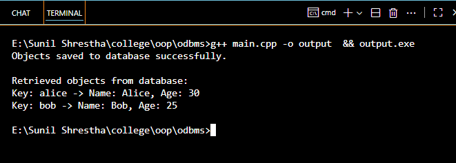
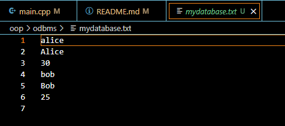

<!-- documentation here, based on the format provided in the README.md file -->

# 🗂️ Introduction to Example

A **"shelf"** is a dictionary-like object. It takes ordinary strings as keys and can store anything that the `pickle` module can handle, which basically includes most class instances, recursive data types, and objects containing lots of shared sub-objects.

```python
# This code defines the class of data we are going to store
class Person:
    def __init__(self, name, age):
        self.name = name
        self.age = age
```

```python
person1 = Person("Alice", 30)   # Define data to be stored
db["alice"] = person1           # d[key] = data => store data at key (overwrites old data if key exists)
retrieved_person = db["alice"]  # data = d[key] => retrieve a COPY of the data at key and raises KeyError if no such key exists
```

---

## ⚙️ Explanation of the Code (How OOP is Implemented)

This code uses **Object Oriented Programming (OOP)** and **file handling** in C++ to simulate an **Object Oriented Database (OODB)**.

### 1. 🧩 Object Definition

An object blueprint is defined using a class.

- **Constructor:** Initialize the object

  ```c++
  Person() : age(0) {}    // Default age 0
  Person(string n, int a) : name(n), age(a) {}
  ```

- **Getters:** For accessing the private members

  ```c++
  string getName() const { return name; }
  int getAge() const { return age; }
  ```

- **Simulate Database:** Use file handling to read and write the file which works as a database.

  ```c++
  void save(ofstream& out) const {
      out << name << '\n' << age << '\n';
  }

  void load(ifstream& in) {
      getline(in, name);
      in >> age;
      in.ignore();
  }
  ```

- **Display:** Print data in terminal

  ```c++
  void display() const {
      cout << "Name: " << name << ", Age: " << age << endl;
  }
  ```

---

### 2. 🧠 Define Object

`Person` object is used to store data and `map` for mapping objects to keys.

```c++
Person person1("Alice", 30);  // Data to store

map<string, Person> db;
db["alice"] = person1;       // maps person1 to key alice
```

---

### 3. 📁 Open File in Write Mode

```c++
ofstream outFile("mydatabase.txt");
if (!outFile) {
    cerr << "Error opening file for writing." << endl;
    return 1;
}
```

---

### 4. 💾 Save Object to Database (Simulated)

This code iterates over entries in the map object and writes them to the database.

```c++
for (auto& entry : db) {
    string key = entry.first;
    Person& person = entry.second;

    outFile << key << '\n';
    person.save(outFile);
}
```

---

### 5. 📖 Open File in Read Mode

```c++
ifstream inFile("mydatabase.txt");
if (!inFile) {
    cerr << "Error opening file for reading." << endl;
    return 1;
}
```

---

### 6. 🧱 Store Entries Present in Database

```c++
map<string, Person> loadedDb;
while (true) {
    string key;
    if (!getline(inFile, key)) break;

    Person p;
    p.load(inFile);
    loadedDb[key] = p;
}
```

---

### 7. 🖥️ Display Retrieved Data in Terminal

```c++
cout << "\nRetrieved objects from database:\n";
for (auto& entry : loadedDb) {
    string key = entry.first;
    Person& person = entry.second;
    cout << "Key: " << key << " -> ";
    person.display();
}
```

---

## 🚀 Output of the Code

Run the code using the following commands:

```bash
g++ main.cpp -o output
./output
```

---

When executed, the program runs as shown below:



---

After execution, a file is created to simulate the database storage:


