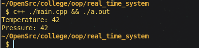

--
## Introduction to Example

This example demonstrates a simple object-oriented programming (OOP) implementation in C++. It features a `Sensor` class that simulates data reading and a `RealTimeSystem` class that manages multiple sensors and processes their data.

## Explanation of the code (How is OOP Implemented)

1. **Classes**:
   - The code defines two classes: `Sensor` and `RealTimeSystem`.
   - **Sensor Class**:
     - Represents an individual sensor with a `name` attribute.
     - Contains a constructor to initialize the sensor's name and a method `readData()` that simulates reading data (returns a fixed value of 42).
   - **RealTimeSystem Class**:
     - Manages a collection of `Sensor` objects stored in a `vector`.
     - The constructor initializes the `sensors` vector with two sensors: "Temperature" and "Pressure".
     - Contains a method `processData()` that iterates through the sensors, retrieves data from each, and prints the sensor name along with its data.

2. **Encapsulation**:
   - Each class encapsulates its data and behavior. For example, the `Sensor` class has its own data members and methods, promoting modularity.

3. **Object Interaction**:
   - The `RealTimeSystem` class interacts with multiple `Sensor` objects, demonstrating how objects can communicate and work together within a system.

## Output of the code

When the code is executed, it produces the following output:

```
Temperature: 42
Pressure: 42
```


This output shows the names of the sensors followed by the simulated data they provide.
